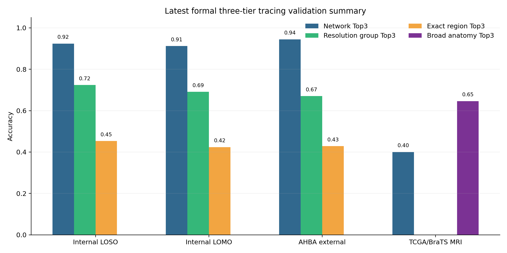

# 最新三级溯源路线与论文初稿指导文件

生成日期：2026-06-17
适用版本：`codex-reference-projection-hybrid-audit` 分支，提交 `f46d9ee` 之后的主线算法
核心结论：正式主线采用 `projected VSD Network Top3 beam -> logCPM resolution group rerank -> logCPM local exact rerank`。

## 1. 论文主线定位

本文不应把 Bo2023 exact-region Top1 作为唯一终点。当前结果显示，跨域泛化最稳定的层级是 SaleemNetworks；resolution group 可显著缓冲低分辨率脑区之间的混淆；exact region 应作为局部候选排序，而不是单点确定性结论。

建议论文主张写成：

> We propose a hierarchical cfRNA brain-origin tracing framework that first uses a reference-projected VSD space for robust network-level candidate generation, then switches to logCPM local expression evidence for resolution-group and exact-region reranking.

中文表述：

> 本研究提出一种分层 cfRNA 脑源溯源框架：先将 cfRNA 表达投影到 Bo2023 VSD 参考空间以获得稳健的 Network Top3 候选，再回到 logCPM 局部表达空间完成 resolution group 与 exact region 重排序。

## 2. 最新主线算法

正式推理路线：

```text
Input cfRNA expression
  -> logCPM/logTPM representation
  -> reference projector maps query into Bo2023-like VSD space
  -> SaleemNetworks Top3 beam
  -> restrict candidate Bo2023 regions to Network Top3
  -> logCPM local discriminative-gene scoring
  -> resolution group rerank
  -> local exact-region rerank inside ordered groups
```

主线代码位置：

- Network candidate generation: [`core/network_tracing.py`](../core/network_tracing.py)
- Three-tier region reranking: [`core/bo2023_region_tracing.py`](../core/bo2023_region_tracing.py)
- Streamlit 主线触发与展示: [`app/pages/tracing_page.py`](../app/pages/tracing_page.py)
- Query 表达读取保留 `read_count/log_tpm`: [`data_processor.py`](../data_processor.py)
- Projector artifact: [`data/models/bo2023_reference_projector_linear_full.npz`](../data/models/bo2023_reference_projector_linear_full.npz)

关键实现原则：

- `projected VSD` 只用于 Network Top3 beam，因为它在跨数据域候选生成上最稳。
- `logCPM` 用于 resolution group 与 exact rerank，因为它在局部表达相似性、尤其 subcortical/insula 标签上更能保留 exact-region 信息。
- 若样本有 `read_count`，优先计算 logCPM；若没有，退回 `log_tpm` 或 `log1p(TPM)`，并在 metadata 中标记 fallback。
- exact-region Top1 必须结合 resolution group 与 manual-review 标志解释。

## 3. 内部验证路线

内部验证采用 Bo2023 样本级严格拆分，所有 fold 内局部特征选择、Network beam、resolution group 和 exact rerank 都在训练侧重建。

### 3.1 LOSO

验证设计：leave-one-sample-out，`n=814` 可评估样本。

| 层级 | Top1 | Top3 | 解释 |
|---|---:|---:|---|
| Network | 0.5835 | 0.9238 | 主结论层级，Top3 beam 稳定 |
| Resolution group | 0.4447 | 0.7236 | 推荐作为 region 层的主要报告粒度 |
| Exact region | 0.2248 | 0.4533 | 用作局部候选，不宜单独作为确定性 endpoint |

结果文件：

- `results/bo2023_reference_projection_20260616_cleaned_symbols/formal_three_tier_loso_hybrid/hybrid_formal_loso_summary.json`
- `results/bo2023_reference_projection_20260616_cleaned_symbols/formal_three_tier_loso_hybrid/hybrid_formal_loso_network_detail.csv`
- `results/bo2023_reference_projection_20260616_cleaned_symbols/formal_three_tier_loso_hybrid/hybrid_formal_loso_resolution_group_detail.csv`
- `results/bo2023_reference_projection_20260616_cleaned_symbols/formal_three_tier_loso_hybrid/hybrid_formal_loso_exact_region_detail.csv`

### 3.2 LOMO

验证设计：leave-one-monkey-out，测试跨个体泛化，`n=819` Network 样本，`n=812` region 可评估样本。

| 层级 | Top1 | Top3 | 解释 |
|---|---:|---:|---|
| Network | 0.5775 | 0.9121 | 跨个体仍保持高 Top3 beam 覆盖 |
| Resolution group | 0.4138 | 0.6909 | 比 exact-region 更适合作为稳定 region-level endpoint |
| Exact region | 0.2217 | 0.4236 | 与 LOSO 接近，说明 exact 限制主要来自区域分辨率而非单纯过拟合 |

结果文件：

- `results/bo2023_reference_projection_20260616_cleaned_symbols/formal_three_tier_lomo_hybrid/formal_lomo_validation_summary.json`
- `results/bo2023_reference_projection_20260616_cleaned_symbols/formal_three_tier_lomo_hybrid/formal_lomo_network_route_metrics.csv`
- `results/bo2023_reference_projection_20260616_cleaned_symbols/formal_three_tier_lomo_hybrid/formal_lomo_resolution_group_route_metrics.csv`
- `results/bo2023_reference_projection_20260616_cleaned_symbols/formal_three_tier_lomo_hybrid/formal_lomo_exact_region_route_metrics.csv`

## 4. 外部验证路线

外部验证统一采用正式三级路线；但不同外部数据集的标签粒度不同，因此报告 endpoint 不同。

### 4.1 AHBA human RNA-seq

路线：AHBA raw counts -> logCPM -> projector -> Bo2023-like VSD Network beam；resolution/exact 使用 AHBA logCPM 与 Bo2023 logCPM 参考局部 rerank。

| Route | Network Top1 | Network Top3 | Group Top3 | Exact Top1 | Exact Top3 |
|---|---:|---:|---:|---:|---:|
| hybrid projected-network + logCPM exact | 0.7468 | 0.9442 | 0.6703 | 0.2418 | 0.4286 |
| logCPM baseline | 0.6266 | 0.9700 | 0.6264 | 0.1758 | 0.3077 |
| projected VSD only | 0.7468 | 0.9442 | 0.5385 | 0.1099 | 0.2967 |

重点标签：

| Label | Network Top3 | Group Top3 | Exact Top3 | 备注 |
|---|---:|---:|---:|---|
| Insula | 1.0000 | 1.0000 | 0.5000 | hybrid 明显优于 logCPM baseline 的 Network 层 |
| Caudate | 1.0000 | 1.0000 | 0.6250 | exact Top1 仍弱，适合报告 group/Top3 |
| Putamen | 1.0000 | 0.8889 | 0.8889 | hybrid 保住 subcortical exact Top3 优势 |

结果文件：

- `results/bo2023_reference_projection_20260616_cleaned_symbols/ahba_external_formal_three_tier/ahba_formal_three_tier_summary.json`
- `results/bo2023_reference_projection_20260616_cleaned_symbols/ahba_external_formal_three_tier/ahba_formal_three_tier_metrics.csv`
- `results/bo2023_reference_projection_20260616_cleaned_symbols/ahba_external_formal_three_tier/ahba_formal_three_tier_special_labels.csv`
- `results/bo2023_reference_projection_20260616_cleaned_symbols/ahba_external_formal_three_tier/ahba_formal_three_tier_accuracy.png`

### 4.2 TCGA/BraTS MRI-labeled glioma RNA-seq

路线：TCGA/BraTS RNA-seq -> projected VSD Network beam + logCPM local rerank；MRI 标签来自 human atlas / broad anatomy，不报告 Bo2023 exact-region accuracy。

| Route | Network Top1 | Network Top3 | Lobe Top3 | Broad anatomy Top3 |
|---|---:|---:|---:|---:|
| hybrid projected-network + logCPM exact | 0.1538 | 0.4000 | 0.2462 | 0.6462 |
| logCPM baseline | 0.0923 | 0.3231 | 0.2308 | 0.2462 |
| projected VSD only | 0.1538 | 0.4000 | 0.3692 | 0.6462 |

解释边界：

- TCGA/BraTS 是肿瘤组织 RNA-seq + MRI 解剖标签，不是 cfRNA，也不是 macaque Bo2023 exact label。
- 该数据集适合支持“跨域粗粒度解剖信号存在”，不适合声称 exact Bo2023 region 准确率。
- Broad anatomy Top3 `0.6462` 可作为外部 coarse anatomical consistency 证据。

结果文件：

- `results/bo2023_reference_projection_20260616_cleaned_symbols/tcga_labeled_hybrid_formal_external/tcga_labeled_hybrid_formal_summary.json`
- `results/bo2023_reference_projection_20260616_cleaned_symbols/tcga_labeled_hybrid_formal_external/tcga_labeled_hybrid_formal_metrics.csv`
- `results/bo2023_reference_projection_20260616_cleaned_symbols/tcga_labeled_hybrid_formal_external/tcga_labeled_hybrid_formal_accuracy.png`

## 5. 图表清单

建议论文初稿优先使用以下图表。

### Figure 1. 最新正式三级验证汇总



源文件：[`docs/figures/latest_three_tier_validation_summary.png`](figures/latest_three_tier_validation_summary.png)

建议图注：

> Summary of the latest formal three-tier validation route. Network Top3 remains the most robust endpoint across internal and AHBA external validation, while resolution-group and exact-region metrics quantify progressively finer anatomical localization. TCGA/BraTS MRI labels support only coarse external anatomical consistency.

### Figure 2. AHBA 外部验证路线对比

源图：`results/bo2023_reference_projection_20260616_cleaned_symbols/ahba_external_formal_three_tier/ahba_formal_three_tier_accuracy.png`

建议用途：展示 hybrid 路线同时保留 projected VSD 的 Network 优势和 logCPM 的 region-local 优势。

### Figure 3. TCGA/BraTS MRI-labeled 外部粗粒度验证

源图：`results/bo2023_reference_projection_20260616_cleaned_symbols/tcga_labeled_hybrid_formal_external/tcga_labeled_hybrid_formal_accuracy.png`

建议用途：展示肿瘤 RNA-seq / MRI 标签场景下仅能解释 coarse anatomical consistency，避免 exact-region 过度解读。

### Figure 4. Projector QC 与内部开发图

源图：

- `results/bo2023_reference_projection_20260616_cleaned_symbols/figures/projector_gene_qc_distributions.png`
- `results/bo2023_reference_projection_20260616_cleaned_symbols/figures/internal_network_accuracy.png`
- `results/bo2023_reference_projection_20260616_cleaned_symbols/figures/internal_true_rank_distribution.png`
- `results/bo2023_reference_projection_20260616_cleaned_symbols/figures/internal_decision_margin_boxplot.png`

建议用途：放入方法补充图或 Extended Data，说明 projector 质量、Network beam 稳定性和 true-rank 分布。

## 6. 论文初稿结构建议

### Title

建议标题：

> Hierarchical brain-origin tracing from cfRNA using reference-projected transcriptomic atlases

备选标题：

> Reference-projected cfRNA expression enables hierarchical brain-region source tracing

### Abstract 逻辑

1. 背景：cfRNA 可提供组织损伤来源信息，但 brain-region-level 溯源受跨平台、跨物种和区域相似性限制。
2. 方法：构建 Bo2023 macaque brain atlas based hierarchical tracer；使用 logCPM-to-VSD reference projector 生成 robust Network beam，再用 logCPM local evidence 做 resolution/exact rerank。
3. 结果：内部 LOSO/LOMO Network Top3 超过 0.91；AHBA 外部 Network Top3 0.9442，Group Top3 0.6703，Exact Top3 0.4286；TCGA/BraTS MRI 标签支持 coarse anatomy Top3 0.6462。
4. 结论：分层 endpoint 比单一 exact-region endpoint 更适合 cfRNA brain-origin inference。

### Introduction 要点

- cfRNA 溯源需要区分“组织层级信号”和“精确解剖标签”。
- Bo2023 提供高分辨率 macaque brain transcriptomic atlas，但 VSD reference 与外部 raw counts/TPM 存在尺度差异。
- Excel gene symbol 污染和跨域 gene-map 清理是必要步骤。
- 直接 exact-region matching 在相邻脑区、低样本脑区和 subcortical 标签上不稳定，因此需要 hierarchical inference。

### Methods 要点

建议方法小节：

1. Bo2023 reference preprocessing and gene-symbol audit
2. logCPM-to-VSD reference projection
3. SaleemNetworks-level candidate generation
4. Resolution-group construction and local exact-region reranking
5. Internal LOSO and LOMO validation
6. AHBA external cross-species validation
7. TCGA/BraTS MRI-labeled coarse anatomical validation

关键方法句：

> The VSD-projected query was used only for network-level candidate generation. All downstream resolution-group and exact-region reranking was performed in a logCPM-compatible local expression space.

### Results 要点

建议结果小节：

1. Reference projection produces a stable network-level candidate space
2. The formal three-tier route improves interpretability over direct exact-region calling
3. LOSO/LOMO validation supports network Top3 as the primary endpoint
4. AHBA external validation shows hybrid recovery of exact-region signal after Network beam generation
5. TCGA/BraTS MRI validation supports coarse anatomical consistency but not exact Bo2023 region accuracy

### Discussion 要点

必须写清：

- `Network Top3` 是主 endpoint。
- `resolution group` 是 region 层最稳的报告粒度。
- `exact region` 是候选排序，适合 Top3/局部解释，不宜过度解释 Top1。
- TCGA/BraTS 只能作为 coarse anatomy external sanity check。
- 未来 cfRNA 真正外部验证需要有可追踪损伤部位、采血时间和 matched imaging/clinical metadata。

## 7. 推荐表格

### Table 1. Internal validation

| Validation | Network Top3 | Group Top3 | Exact Top3 |
|---|---:|---:|---:|
| LOSO | 0.9238 | 0.7236 | 0.4533 |
| LOMO | 0.9121 | 0.6909 | 0.4236 |

### Table 2. External validation

| Dataset | Network Top3 | Group Top3 | Exact Top3 | Broad Top3 | Notes |
|---|---:|---:|---:|---:|---|
| AHBA | 0.9442 | 0.6703 | 0.4286 | NA | cross-species RNA-seq; exact only for mapped labels |
| TCGA/BraTS | 0.4000 | NA | NA | 0.6462 | MRI-derived human labels; no Bo2023 exact endpoint |

## 8. 当前最重要的解释边界

不要写：

- “本方法可以准确定位所有 exact brain region。”
- “TCGA/BraTS 证明 Bo2023 exact-region 溯源准确。”
- “projected VSD 在 exact-region 层级优于 logCPM。”

可以写：

- “Network-level candidate generation is robust across internal and AHBA external validation.”
- “Resolution groups provide a more defensible region-level endpoint than exact Top1 calls.”
- “logCPM local reranking partially recovers exact-region signal after projected-VSD Network beam generation.”
- “TCGA/BraTS provides coarse anatomical consistency but not exact Bo2023 region validation.”

## 9. 下一步论文工作

建议按顺序推进：

1. 固定当前主线代码和 artifact，不再把旧 route 混入主文结果。
2. 为 Figure 1 重新导出 300 dpi TIFF/PDF 版本，用于投稿排版。
3. 把 AHBA special labels 中的 Caudate/Putamen/Insula 做一个小表或 Extended Data。
4. 为 Methods 补充 projector 公式、fallback gene 处理和 gene-symbol audit。
5. 将 TCGA/BraTS 放入 “external coarse anatomical consistency” 小节，避免与 AHBA exact mapped validation 混写。
6. 若需要增强临床相关性，下一轮优先寻找带明确损伤/手术/影像定位的 cfRNA 或 plasma RNA 数据。
